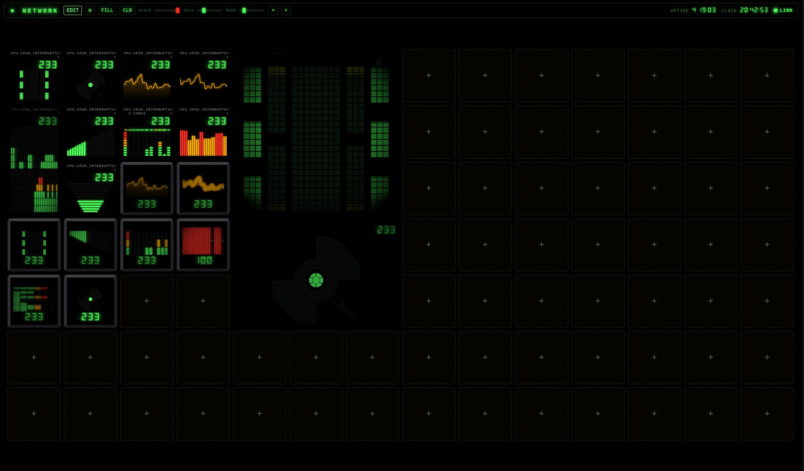
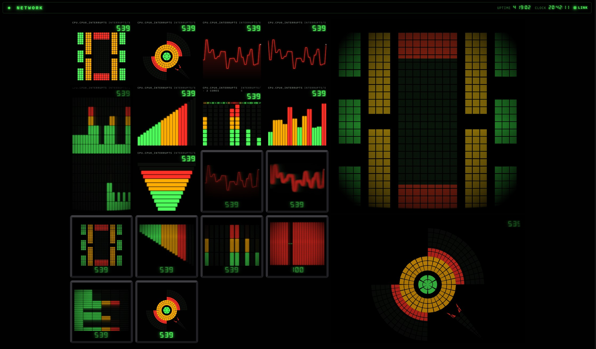
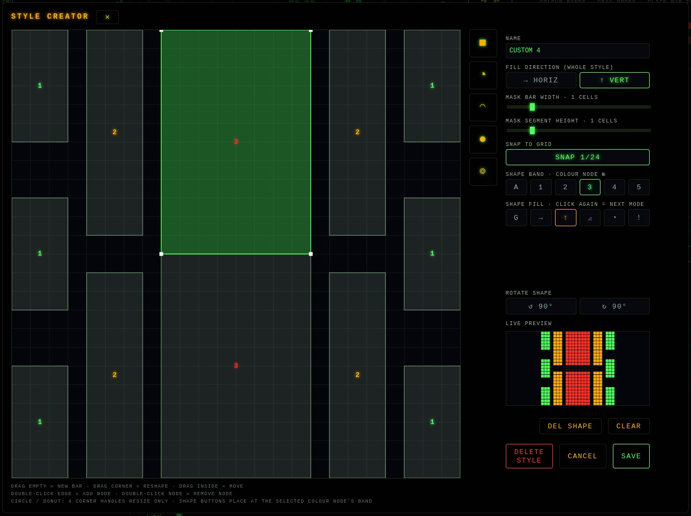
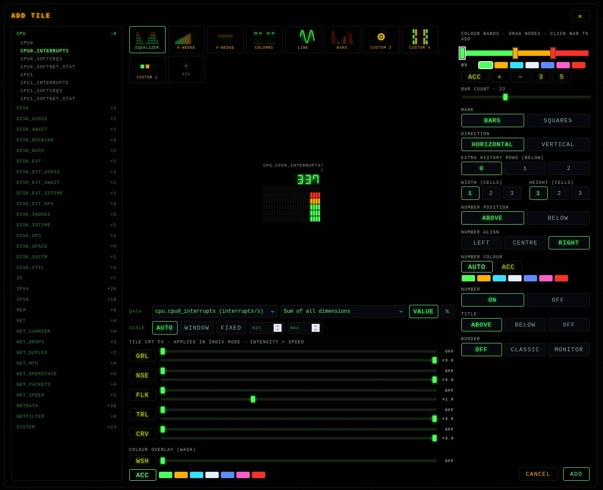

# HOMELAB NETDATA RETRO CONSOLE

A retro-CRT dashboard for [Netdata](https://www.netdata.cloud/) in **one self-contained HTML file**. No build step, no framework, no dependencies - just open it in a browser and point it at any Netdata instance (a router, a NAS, a server).

Built.....Vibecoded as a homelab status screen. Styled after 70s/80s terminal and CRT hardware: DSEG 7-segment readouts, LED equalizers, phosphor trails, and a real WebGL scanline/grille shader.

_One metric, a dozen looks - every graph style side by side:_

_The style creator: draw your own gauges on a snap grid:_

_Pick any Netdata chart from the navigator tree:_

## Quick start

1. Download `index.html` and the `fonts/` folder (keep them side by side).
2. Open it in Chrome/Chromium, press **Enter** and go to the **Network** tab: set your Netdata host (`http://192.168.1.1:19999`), optionally the update interval and a board title, then **Apply & reload**. All of it is remembered in the browser.
   (URL parameters work too: `index.html?host=http://192.168.1.1:19999&refresh=2000`.)
3. Click the board title and build your board.

## Features

- **Fixed-cell grid** - drag & drop tiles, per-tile W×H (1-3 cells), gaps allowed, screen-fit sliders for scale / columns / rows, grid alignment, and accent themes that re-skin the whole console.
- **Tile editor** - chart navigator tree (every Netdata data point grouped, with what's already on the board marked), live true-size preview fed by real data, any chart + dimension (value or % of total), and scale modes: auto, window (min-max of the visible history, keeps any graph lively) or a fixed range. Number position / alignment / colour / on-off, title above / below / off.
- **Graph styles** - LED equalizer (up to 2 cascading history rows: one column = one full sweep, averaged, filling right to left), H/V wedges, labelled per-dimension columns (labels can be hidden), line (stepped or a smooth 1 s-delay ticker), history bars - each with anchor, bar count and per-style options.
- **Colour bands** - 1-5 draggable gradient stops per tile; every style colours by value band.
- **Style creator** - draw your own gauges as polygon "bars" on a snap grid; presets for square, quarter/full circle and quarter/full donut; per-shape colour-band binding; fill modes (horizontal, vertical, diagonal, circular sweep or radial in/out with pivot selection, instant); grid-aligned LED mask segmentation; designs are aspect-locked so they never stretch with the tile.
- **CRT FX** - WebGL shader: RGB grille + scanlines + drifting raster line, static noise, flicker, curved-glass vignette, plus phosphor trails and an accent colour wash - every effect with its own intensity _and_ speed. Global mode (one big tube) or individual mode (every tile its own little CRT, automatically desynced), overridable per tile.
- **Borders** - flat, a classic accent line, or a full monitor bezel in dark or aged-beige plastic; the CRT glass sits behind the bezel where it belongs.
- **Multi-edit** - drag a marquee over several tiles in edit mode and batch-change colour bands, numbers, titles, borders, FX and wash; the Apply button counts and applies only what you actually changed.
- **Settings dialog** (press **Enter**) - accent colour and global FX on the Screen tab, Netdata host / update interval / board title + icon on Network, and one-file backup export & import on Save.

Everything persists in localStorage: `rc_layout` (tiles), `rc_grid` (grid, FX, title), `rc_styles` (custom styles), `rc_host` + `rc_refresh` (connection). Delete those keys to factory-reset, or use Settings → Save for a portable backup.

## Requirements & caveats

- **Browser**: Chrome/Chromium (WebGL, `hard-light` blending, HTML5 drag & drop). The dashboard degrades gracefully if WebGL is unavailable (CSS scanlines fallback).
- **Serve it locally, not from HTTPS**: browsers block an HTTPS page (e.g. GitHub Pages) from fetching a plain-HTTP Netdata on your LAN (mixed content). Open the file directly (`file://`) or serve it from a LAN web server over HTTP.
- **CORS**: default Netdata configurations accept these requests. If you get `SIGNAL LOST` with Netdata reachable, check the `[web]` section of your `netdata.conf` (allow connections / access lists).
- **Load**: one `allmetrics` fetch per second (~100–300 KB on a typical router) and a ~30 fps single-pass shader - negligible on both ends.

## License

- Code: [GPL-3.0](LICENSE) - free to use, study and modify; if you distribute it or a project built on it (including serving a modified copy from a website), that project must be open source under the GPL as well.
- The bundled **DSEG14** font is by [keshikan](https://github.com/keshikan/DSEG), licensed under the [SIL Open Font License 1.1](fonts/DSEG-LICENSE.txt) - not covered by the GPL above.
